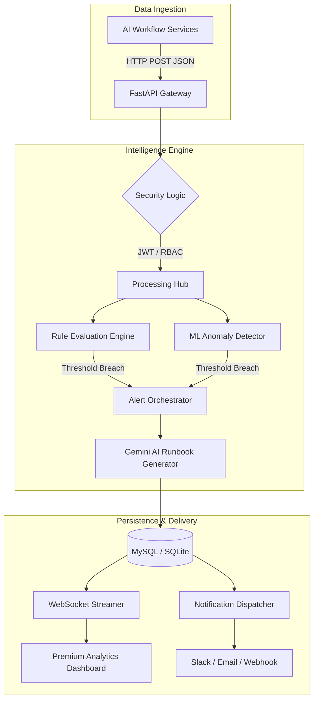

# 🛡️ Alert Service —

**The specialized monitoring and alerting backbone for high-performance AI Workflows.**

[](https://fastapi.tiangolo.com)
[](https://www.python.org/)
[](https://www.mysql.com/)
[](LICENSE)

---

## 🏗️ System Architecture

 Alert Service  utilizes a **Modular Layered Architecture** with integrated AI intelligence and real-time streaming capabilities.



---

## ✨ Advanced Features 

### 🤖 1. AI & Machine Learning Intelligence
- **IsolationForest Anomaly Detection:** Automatically flags statistical outliers in metric data, even when manual rules aren't defined.
- **Generative AI Runbooks:** Powered by **Google Gemini**, the system automatically generates a 5-step technical remediation guide for every High/Critical alert.
- **Natural Language Parsing:** Create monitoring rules via conversational prompts (e.g., *"Alert me if GPU temperature exceeds 85°C"*).

### 🛡️ 2. Enterprise Governance & Security
- **JWT Authentication:** Strict token-based access for all protected endpoints.
- **Role-Based Access Control (RBAC):** Distinct permissions for `Admin` (management) and `Viewer` (monitoring).
- **API Rate Limiting:** Built-in protection against ingestion flooding and DDoS attempts.

### 📊 3. Premium Observability
- **Real-time WebSocket Streaming:** Live alert notifications pushed to the dashboard with sub-second latency.
- **Interactive Analytics Dashboard:** Rich visualizations using **Chart.js** to track service impact, severity trends, and system health.
- **Full Alert Lifecycle:** Comprehensive state management including `OPEN`, `ACKNOWLEDGED`, `RESOLVED`, and `SUPPRESSED`.

---

## 🚀 Quick Start Guide

### 1. Prerequisites
- **Python 3.10+** (Virtual environment recommended)
- **MySQL 8.0** or **SQLite**
- **Google Gemini API Key** (for intelligence features)

### 2. Installation
```bash
git clone https://github.com/prasaddesai24-source/Rubiscape-Alert-Service.git
cd Rubiscape-Alert-Service
pip install -r requirements.txt
```

### 3. Configuration
Copy settings to your `.env` file:
```ini
DB_TYPE=mysql
JWT_SECRET_KEY=yoursecret
GEMINI_API_KEY=yourkey
SMTP_PASSWORD=yourapppassword
```

### 4. Launch
```bash
# Start the server (Windows optimized)
python run.py

# Run the end-to-end demo
python demo.py
```

---

## 📡 API Reference

| Endpoint | Method | Security | Description |
| :--- | :--- | :--- | :--- |
| `/auth/login` | `POST` | Public | Exchange credentials for JWT token |
| `/events/` | `POST` | JWT | Ingest metric -> AI Processing |
| `/rules/from-text` | `POST` | Admin | Create rule via Natural Language |
| `/alerts/metrics/report`| `GET` | Viewer | Get raw analytical metrics (JSON) |
| `/dashboard` | `GET` | Public | Live-feed monitoring dashboard |
| `/analytics` | `GET` | Public | Premium analytics report page |

---

## 📁 System Metrics Monitored

| Metric | Implementation | Industry Use-Case |
| :--- | :--- | :--- |
| **latency** | Response tracking | SLI/SLO Compliance |
| **error_rate** | Failures % | Platform Stability |
| **gpu_usage** | Resource monitoring | Model Inference Scaling |
| **cpu_usage** | Load tracking | Infrastructure Right-sizing |
| **throughput** | Performance | Customer Experience (CX) |

---

## 🏢 Business Alignment
Alert Service is designed for **Enterprise AI Observability**. It bridges the gap between raw execution data and actionable technical insights, ensuring high reliability for critical AI workflows.

---
*Rubiscape Alert Service © 2026 — Built for the future of AI Operations.*
